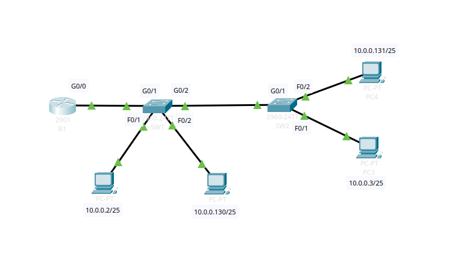

# Cisco VLAN & Inter-VLAN Routing Lab  
**Complete Layer 2 + Layer 3 Lab with Router-on-a-Stick**



## Overview
A fully working Packet Tracer lab that demonstrates:
- Layer 2 VLAN segregation
- 802.1Q trunking between switches
- Inter-VLAN routing using subinterfaces (Router-on-a-Stick)
- Real-world packet flow with VLAN tagging

### Networks
| VLAN | Name   | Subnet              | Gateway       | Hosts                              |
|------|--------|---------------------|---------------|------------------------------------|
| 13   | DATA   | 10.0.0.0 /25        | 10.0.0.1      | PC1 (10.0.0.2), PC3 (10.0.0.131)  |
| 24   | GUEST  | 10.0.1.0 /25        | 10.0.1.1      | PC2 (10.0.1.130), PC4 (10.0.1.131)|

## Learning Objectives
- Understand how 802.1Q tags are added/removed on trunks
- Configure access ports vs trunk ports correctly
- Implement inter-VLAN routing without a Layer 3 switch
- Verify traffic isolation and routing behavior

## Devices (Packet Tracer)
- 1 × Cisco 2911 Router (R1)
- 2 × Cisco 2960-24TT Switches (SW1, SW2)
- 4 × PCs with static IPs

## Configuration (Copy-Paste Ready)

### SW1 – Access Ports + Trunk
```
vlan 13
 name DATA
vlan 24
 name GUEST
!
interface FastEthernet0/1
 switchport mode access
 switchport access vlan 13
 spanning-tree portfast
!
interface FastEthernet0/2
 switchport mode access
 switchport access vlan 24
 spanning-tree portfast
!
interface GigabitEthernet0/2
 switchport mode trunk
 switchport trunk allowed vlan 13,24
```

SW2 – Access Ports + Trunk
```
vlan 13
 name DATA
vlan 24
 name GUEST
!
interface FastEthernet0/1
 switchport mode access
 switchport access vlan 13
 spanning-tree portfast
!
interface FastEthernet0/2
 switchport mode access
 switchport access vlan 24
 spanning-tree portfast
!
interface GigabitEthernet0/1
 switchport mode trunk
 switchport trunk allowed vlan 13,24
```
```
R1 – Router-on-a-Stick (no switchport commands!)
ciscointerface GigabitEthernet0/0
 no shutdown
 description Trunk to SW1
!
interface GigabitEthernet0/0.13
 encapsulation dot1Q 13
 ip address 10.0.0.1 255.255.255.128
 no shutdown
!
interface GigabitEthernet0/0.24
 encapsulation dot1Q 24
 ip address 10.0.1.1 255.255.255.128
 no shutdown          
```
Expected Results

PC1 ↔ PC3: Success (same VLAN 13)
PC2 ↔ PC4: Success (same VLAN 24)
PC1 ↔ PC4: Success (via R1 – inter-VLAN routing)
No direct Layer 2 communication between VLAN 13 and VLAN 24
